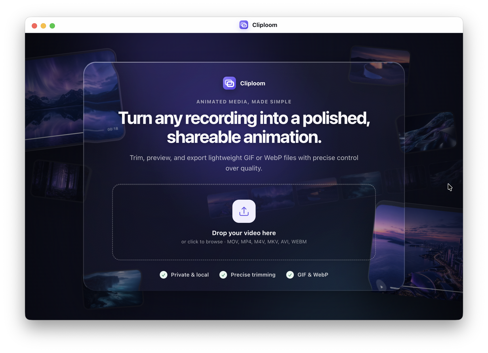

<p align="center">
  
</p>

<h1 align="center">Cliploom</h1>

<p align="center">
  <strong>Turn any recording into a polished, shareable animation.</strong><br>
  A macOS Electron app for trimming, previewing, and exporting lightweight GIF and WebP loops — privately, on your machine.
</p>

<p align="center">
  
</p>

<br>

## Why Cliploom

Screen recordings are great for demos. Sharing them usually isn’t — large files, awkward formats, and cloud converters that shouldn’t see your work.

Cliploom is a focused desktop tool for that last mile: load a video, trim the moment that matters, tune quality, and export a clean GIF or WebP ready for docs, PRs, Slack, or marketing.

Everything stays local. Encoding runs through FFmpeg on your Mac.

<br>

## What you can do

| | |
| --- | --- |
| **Import** | Drop MOV, MP4, M4V, MKV, AVI, or WEBM — or browse from disk |
| **Trim** | Set precise in/out points with a visual timeline and live preview |
| **Preview** | Check the result before you export, so you don’t guess at quality |
| **Export** | Output GIF, WebP, or both in one pass |
| **Tune** | Choose Low Size, Balanced, High Quality — or take full custom control |
| **Polish** | Adjust FPS, width, palette/quality, and optional corner radius |

<br>

## Built for privacy

Cliploom never uploads your footage. Conversion happens entirely on-device using bundled FFmpeg binaries. Ideal for product demos, internal tools, and anything that shouldn’t leave your machine.

<br>

## Getting started

### Requirements

- macOS on Apple Silicon
- Node.js 20+
- npm

### Install dependencies

```bash
npm install
```

### Run in development

```bash
npm run dev
```

This starts the Vite renderer and launches the Electron shell.

### Build & run locally

```bash
npm run build
npm start
```

### Package a macOS release

```bash
npm run dist:mac
```

Signed packaging artifacts are written to `release/` (DMG and ZIP for `arm64`).

<br>

## Architecture

```text
cliploom/
├── electron/        Main process — media probing, FFmpeg conversion, IPC
├── shared/          Shared types, quality presets, trim helpers
├── src/renderer/    React UI — landing, workspace, timeline, export controls
├── build/           App icons for electron-builder
└── docs/images/     README media
```

| Layer | Responsibility |
| --- | --- |
| **Electron main** | File dialogs, `ffprobe` metadata, conversion pipeline, progress events |
| **Preload bridge** | Typed `window.api` surface between UI and main |
| **React renderer** | Workspace UX, timeline trim, settings, export summary |
| **Shared module** | Presets and types used by both processes |

<br>

## Scripts

| Command | Description |
| --- | --- |
| `npm run dev` | Hot-reload UI + Electron |
| `npm run build` | Compile main process and production renderer |
| `npm start` | Build, then launch the packaged entrypoint |
| `npm run dist:mac` | Produce macOS DMG/ZIP via electron-builder |

<br>

## License

Proprietary. All rights reserved.
