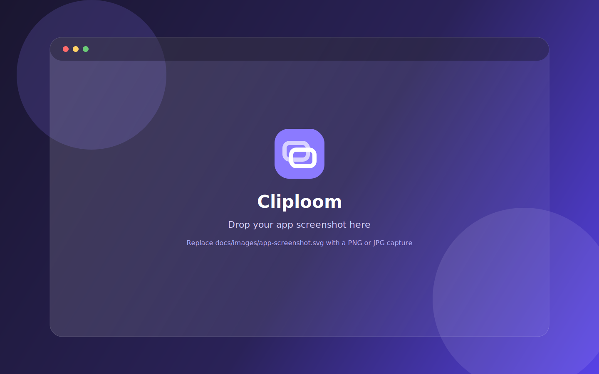

<p align="center">
  
</p>

<h1 align="center">Cliploom</h1>

<p align="center">
  <strong>Craft polished GIF and WebP loops from screen recordings.</strong>
</p>

<p align="center">
  Trim, preview, and export lightweight animated media — privately, on your Mac.
</p>

<p align="center">
  
</p>

<p align="center">
  <em>Replace <code>docs/images/app-screenshot.svg</code> with a real app screenshot when ready.</em>
</p>

---

## Features

- **Local & private** — conversion runs on your machine with FFmpeg; nothing is uploaded
- **Precise trimming** — set in/out points with a visual timeline and live preview
- **GIF & WebP export** — export one or both formats in a single pass
- **Quality presets** — Low Size, Balanced, High Quality, or full custom controls
- **Polished output** — control FPS, width, colors, quality, and optional corner radius

## Tech stack

| Layer | Tools |
| --- | --- |
| Desktop shell | Electron |
| UI | React + Vite + TypeScript |
| Encoding | FFmpeg (`ffmpeg-static`, `fluent-ffmpeg`) |

## Getting started

### Requirements

- macOS (Apple Silicon builds are configured)
- Node.js 20+ recommended
- npm

### Install

```bash
npm install
```

### Develop

```bash
npm run dev
```

Starts Vite for the renderer and launches the Electron app.

### Production build

```bash
npm run build
npm start
```

### Package macOS app

```bash
npm run dist:mac
```

Artifacts are written to `release/`.

## Project structure

```text
├── electron/          # Main process, FFmpeg conversion, IPC
├── shared/            # Shared types, presets, trim helpers
├── src/renderer/      # React UI
├── build/             # App icons for packaging
└── docs/images/       # README brand assets & screenshots
```

## Brand assets

| Asset | Path |
| --- | --- |
| Logo mark | [`docs/images/cliploom-logo.svg`](docs/images/cliploom-logo.svg) |
| App icon | [`docs/images/cliploom-icon.png`](docs/images/cliploom-icon.png) |
| App screenshot | [`docs/images/app-screenshot.svg`](docs/images/app-screenshot.svg) _(placeholder)_ |

## License

Private project — all rights reserved.
